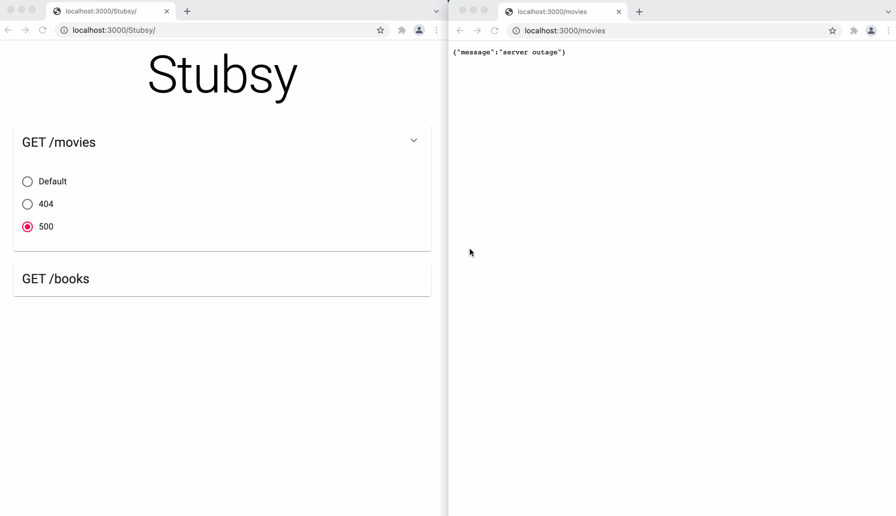

# Stubsy

* [Installation](#installation)
* [Usage](#usage)
  * [Definitions](#definitions)
  * [API](#api)
  * [Example](#example)

Stubsy is a Node server built using Express. Its main goal is to allow
developers to easily set up the server but more importantly change its
behaviour after launch. This can be useful to test how the UI behaves
when an endpoint's response is `404` instead `200` for example.

Stubsy ships with a UI to show the set up of the server and allow
changing endpoint's behaviour.



## Installation

```text
npm install --save-dev stubsy
```

## Usage

### Definitions

#### Endpoint

An `Endpoint` is REST endpoint, that is set up with a default
behaviour. An endpoint's behaviour is defined as follows.

```ts
type EndpointBehaviour = {
  path: string; // the route at which the endpoint is accessed
  responseBody: unknown;
  status: number;
  type: 'get' | 'post' | 'put' | 'delete' | 'patch';
  delay?: number;
};
```

**Note**: the `path` field can be any valid
[Express path](http://expressjs.com/en/guide/routing.html#route-paths).

#### Override

An `Override` is an overriding behaviour for an Endpoint to alter its
response. The override behaviour is defined as follows. The `path` and
`type` of the endpoint cannot be changed in an `Override`.

```ts
type OverrideBehaviour = {
  responseBody: unknown;
  status: number;
  delay?: number;
};
```

### API

#### `new Stubsy(portNumber)`

Creates an instance of `Stubsy`.

* `portNumber` \<Number\>: the port for the server to run on

#### `stubsy.app`

The underlying Express app. Use this instance variable to add more endpoints if needed
and to start the server.

#### `stubsy.registerEndpoint(endpointId, endpointBehaviour)`

Registers endpoints to be accessed on the server.

* `endpointId` \<String\> **required**: a unique identifier for the endpoint
* `endpointBehaviour` \<EndpointBehaviour\> **required**: the endpoint's behaviour

#### `stubsy.registerOverride(endpointId, overrideId, overrideBehaviour)`

Registers override behaviour for a previously defined endpoint.

* `endpointId` \<String\> **required**: the id of the endpoint to register
an override for
* `overrideId` \<String\> **required**: a unique identifier for the override
* `overrideBehaviour` \<OverrideBehaviour\> **required**: the override's behaviour

#### `stubsy.activateOverride(endpointId, overrideId)`

Activates the specified override on the endpoint.

* `endpointId` \<String\> **required**: the id of the endpoint to activate
the override on
* `overrideId` \<String\>: the id of the override to activate. If omitted
restores the override to the default behaviour.

#### ~~`stubsy.start()`~~ **Deprecated**

Starts the server on the port number specified.

### Example

```js
// server.js
import { Stubsy } from 'stubsy';

const stubsyPortNumber = 3000;
const stubsy = new Stubsy();

stubsy.registerEndpoint('films', {
  path: '/films',
  status: 200,
  type: 'get',
  responseBody: [{ title: 'Inception' }, { title: 'Tenet' }],
});

stubsy.registerOverride('films', 'error', { status: 404, responseBody: {} });
stubsy.registerOverride('films', 'outage', { status: 500, responseBody: {} });

stubsy.activateOverride('films', 'outage');

stubsy.app.listen(stubsyPortNumber);
```
